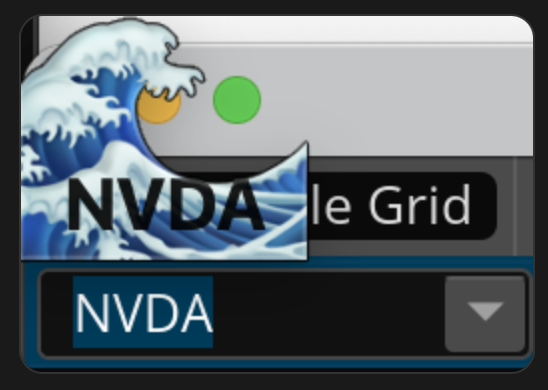
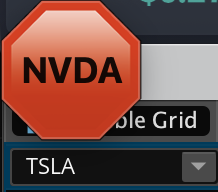
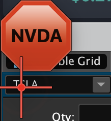

# TVorSwimSync

Keep your TradingView and thinkorswim charts on the same symbol — automatically.

TVorSwimSync is a lightweight macOS menubar widget that watches both apps in real-time and shows you instantly whether they're in sync. When they're not, it can type the symbol into thinkorswim for you.

## Screenshots

| Synced | Not Synced | Auto-Sync Active |
|--------|------------|------------------|
|  |  |  |

## Features

- **Real-time monitoring** — reads window titles from TradingView and thinkorswim every second using macOS Core Graphics (no screen scraping, negligible CPU)
- **Visual status widget** — compact 80×80px floating overlay shows a 🌊 when symbols match and 🛑 when they don't, with the current symbol as text
- **Auto-sync** — automatically types the TradingView symbol into thinkorswim when it changes; uses AppleScript keystroke input so it works regardless of keyboard layout
- **Draggable & persistent** — move the widget anywhere on screen; position is saved across sessions
- **Non-intrusive** — transparent, always-on-top, no Dock entry, never steals focus

## Tech Stack

Built with [Tauri v2](https://tauri.app/) — a Rust + WebView desktop framework — for a native macOS feel with a minimal footprint.

| Layer | Technology |
|-------|------------|
| Frontend | TypeScript, HTML, Tailwind CSS v4 |
| Desktop | Tauri v2, Vite |
| Backend | Rust 2021 |
| macOS APIs | Core Graphics (`CGWindowListCopyWindowInfo`), AppleScript via `osascript` |

## Requirements

- macOS (Apple Silicon or Intel)
- TradingView desktop app
- thinkorswim desktop app
- Screen Recording permission (to read window titles)
- Accessibility permission (for auto-sync keystrokes)

---

> **Note:** The original implementation used Hammerspoon but ran into issues with drag & drop and polling reliability. The current version is a full rewrite in Tauri.
