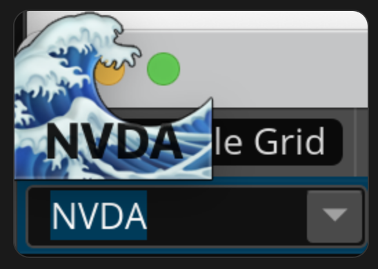
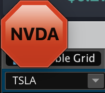
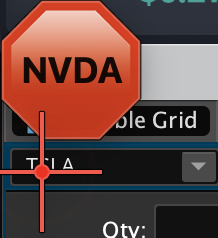

# TVorSwimSync

Keep your TradingView and thinkorswim charts on the same symbol — automatically.

TVorSwimSync is a lightweight macOS menubar widget that watches both apps in real-time and shows you instantly whether they're in sync. When they're not, it can type the symbol into thinkorswim for you.

## Screenshots

| Synced | Not Synced | Auto-Sync Active |
|--------|------------|------------------|
|  |  |  |

## Features

- **Real-time monitoring** — reads window titles from TradingView and thinkorswim every second using macOS Core Graphics (no screen scraping, negligible CPU)
- **Visual status widget** — compact 80×80px floating overlay shows a 🌊 when symbols match and 🛑 when they don't, with the current symbol as text
- **Auto-sync** — automatically types the TradingView symbol into thinkorswim when it changes; uses AppleScript keystroke input so it works regardless of keyboard layout
- **Draggable & persistent** — move the widget anywhere on screen; position is saved across sessions
- **Non-intrusive** — transparent, always-on-top, no Dock entry, never steals focus

## Tech Stack

Built with [Tauri v2](https://tauri.app/) — a Rust + WebView desktop framework — for a native macOS feel with a minimal footprint.

| Layer | Technology |
|-------|------------|
| Frontend | TypeScript, HTML, Tailwind CSS v4 |
| Desktop | Tauri v2, Vite |
| Backend | Rust 2021 |
| macOS APIs | Core Graphics (`CGWindowListCopyWindowInfo`), AppleScript via `osascript` |

## Install

1. Run `npm run tauri:build` from the `tauri-app` directory
2. Drag the built app to your Applications folder (choose **Replace** if upgrading)
3. Grant two permissions:
   - **Screen Recording** — to read window titles from TradingView and thinkorswim
   - **Accessibility** — to type symbols into thinkorswim via auto-sync
   - If upgrading: remove TVorSwimSync from both lists in **System Settings → Privacy & Security**, then re-add it — you can click the shortcut directly from the app icon to open the right settings page

## Development

Run `npm run tauri:dev` to launch the app in dev mode with hot reload.

## Creating a Release

1. Bump the version in `tauri-app/src-tauri/tauri.conf.json`, `tauri-app/src-tauri/Cargo.toml`, and in the `id="current-version"` span in `tauri-app/release-notes.html`
2. Run `git log v<prev>..HEAD --oneline` to see what changed, then add a new entry at the top of `tauri-app/release-notes.html` with those changes as bullet points (copy the previous block, update version/date/bullets, move `current` CSS class and badge to the new block)
3. Build: `cd tauri-app && npm run tauri:build`
4. The DMG is output to `tauri-app/src-tauri/target/release/bundle/dmg/`
5. Commit: `git commit -am "v<version> — <one-line summary>"`
6. Tag: `git tag v<version>`
7. Push: `git push && git push --tags`
8. Create GitHub release: `gh release create v<version> --title "v<version> — 
" --notes "<release notes>" tauri-app/src-tauri/target/release/bundle/dmg/TVorSwimSync_<version>_aarch64.dmg`

## Requirements

- macOS (Apple Silicon or Intel)
- TradingView desktop app
- thinkorswim desktop app
- Screen Recording permission (to read window titles)
- Accessibility permission (for auto-sync keystrokes)

---

> **Note:** The original implementation used Hammerspoon but ran into issues with drag & drop and polling reliability. The current version is a full rewrite in Tauri.
